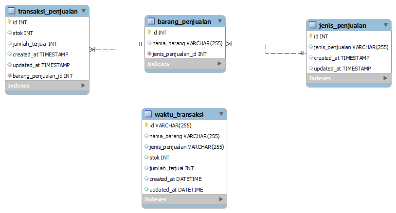

   

# Aplikasi Berbasis Web Data Penjualan dengan Laravel 8

Membuat Aplikasi Berbasis Web Data Penjualan Menggunakan Laravel 8, Yang Bertujuan Untuk Presentasi Kepada Tester. Aplikasi Berbasis Web Data Penjualan dengan Laravel 8 adalah aplikasi yang berfungsi untuk melakukan pendataan barang.

## Desain ERD

## Penjelasan Aplikasi

|<h3>Notes  </h3>       |       Keterangan                                                                  |
|-----------------------|-----------------------------------------------------------------------------------|
|<b>Jenis Penjualan     | </b>Digunakan untuk menyimpan data jenis penjualan.                               |
|<b>Transaksi Penjualan | </b>Digunakan untuk menyimpan data transaksi penjualan. (Master Data Penjualan).  |
|<b>Barang Penjualan    | </b>Digunakan untuk menyimpan data barang penjualan.                              |
|<b>Waktu Transaksi     | </b>Digunakan untuk menyimpan data kapan waktu transaksi.                         |

## Cara Instalasi ke Server Lokal :

-   ketik <b>composser install </b> dan <b>php artisan key generate</b>
-   tulis migrate database pada terminal/cmd/git bash : <b>php artisan migrate:install</b>
-   jalankan php artisan db:seed pada terminal/cmd/git bash : <b>php artisan db:seed</b>

<b>Notes :</b> Untuk db:seed jika males untuk mengetikan data, akan dibuatkan langsung oleh laravelnya.

## Fitur Aplikasi

-   Halaman Utama (Halaman Dashboard)  

A. Menu Data Jenis Barang 

-   Tambah Data (Data Jenis Barang) 
-   Ubah Data (Data Jenis Barang) 
-   Hapus Data (Data Jenis Barang) 

B. Menu Data Master Penjualan 

-   Tambah Data (Data Master Penjualan) 
-   Ubah Data (Data Master Penjualan) 
-   Hapus Data (Data Master Penjualan) 

C. Menu Data Log Transaksi 

-   Reset Data (Data Log Transaksi) 

D. Menu Perbandingan Jenis Data

E. Menu Tambahan

-   Pembuat Website
-   Dokumentasi Singkat

## Alat Yang Digunakan Untuk Membuat Web :

-   WAMP
-   Visual Studio Code
-   Git
-   Cloud (Github)
-   PHP 7.4.9
-   MYSQL 8.0.13
-   Laravel 8
-   Bootstrap 5
-   Composer

